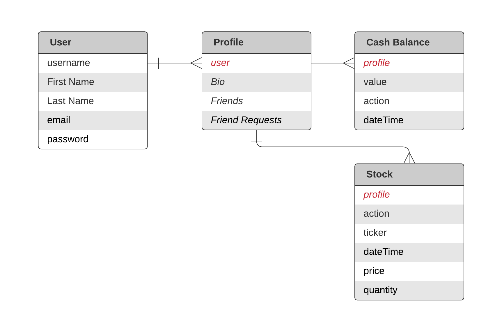
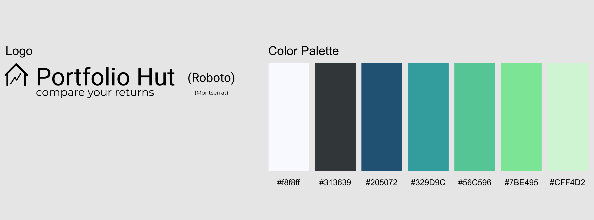
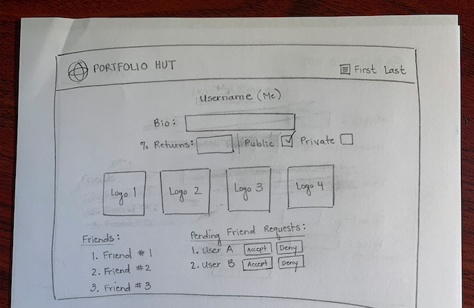
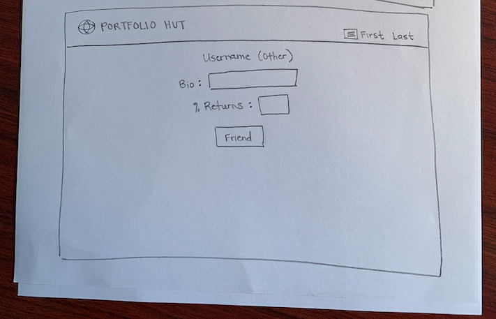
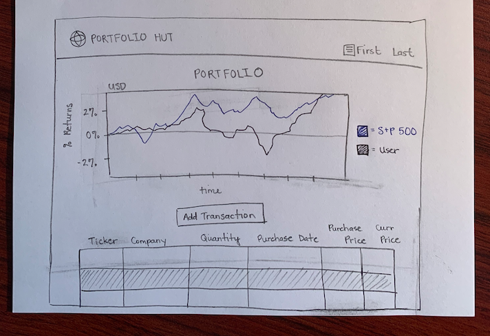
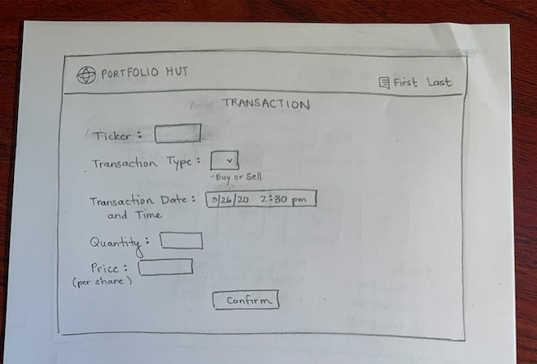
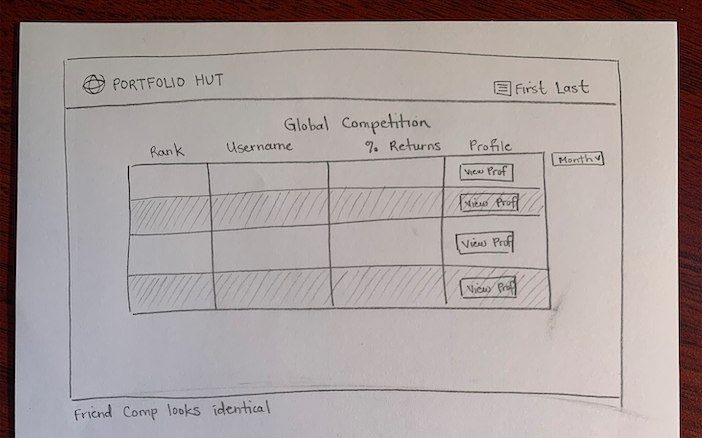

# Product Specification

## Product Backlog

### Landing

On the Landing page, users will be introduced to Portfolio Hut. Specifically,
users will be able to read about the product, and view images of the product in
action, to better understand how it works.

* Login button
* Sign up button
* Product Copy to tell users what the product is
    * Images / Video of Product in Action
* Navbar with the pages (but they are hidden)

### Login

On the Login Page, registered users will be able to sign into their Portfolio
Hut account. They must provide their username and password to login. After
Portfolio Hut authenticates a user’s credentials, the user will be signed in to
the site and redirected to the global competition page.

* Username
* Password
* Password reset (nice to have, separate page)

### Register

On the registration page, users will be able to sign up for a Portfolio Hut
account. The page will request for the following specific pieces of information
to sign a user up. It requires their first name, last name, email, username
(unique across users), and a password. All the prior will be validated to make
sure that they are valid.

* First Name
* Last Name
* Email
    * Email verification (nice to have)
* Username
* Password

### Profile Pages

The Profile Page is where a user will be able to control the social aspects of
the platform. The profile page will show a bio that is visible to all users and
editable only on the currently logged-in user’s page.

All users are shown the list of friends a profile has. Users will be able to
friend and unfriend one another with the “Friend” or “Unfriend” buttons. These
buttons will be visible on the Profile Page for each user except the logged-in
user. The button will show as a pending, unclickable button until a user accepts
/ declines the friend request (much like how Facebook friends work). Pending
friend requests for the logged-in user can be found on the logged-in user’s
Profile Page. Friendships are bidirectional.

Profiles also contain information about a user’s portfolio with varying degrees
of fidelity. All users are shown the return percentage if the user opts into
showing that information. Friends (and the self profile) are always shown the
return percentage, and the top 5 companies invested in by % of portfolio.

* Your profile
    * Username
    * Edit Bio
    * Top 5 companies invested by percent (show logo of ticker)
    * Allow public to view your returns %
        * Withdraws from global competition if not public
    * Show list of friends (link to their profile)
    * Show pending friend requests (accept / deny)
* Others profile
    * Others
        * Username
        * Bio
        * Return % (if allowed)
        * Friend Button
    * Friend Profile
        * In addition to other requirements
        * Top 5 companies invested by percent (show logo of ticker)
        * Unfriend Button

### Global Competition

Users will see a table of the top 10 portfolio performers on the Global
Competition Page. The top portfolio performers will be the individuals with the
highest percent return on investments out of the entire Portfolio Hut community.
The table will show the rank, name, and percent returns for these top
performers. The table will also include a column for a “View Profile” button,
allowing the logged-in user to visit the top performer’s Profile Page.

If the logged-in user is not a top performer, they will still see their name as
the last row in the table. However, if the logged-in user has decided to make
their returns private, this calculation will not occur, and their name will not
be included in the global display.

Finally, the user will be able to customize the competition display.
Specifically, the user will be able to select the time interval (month, year,
all-time) for the global competition.

* List view of the top 10 accounts with the highest return percentage
    * Rank
    * Username
    * Return %
    * Change over the last week (nice to have)
    * Button to view profile
* Selector for time range
    * Month, Year, All-time
* Logged-in user sees their ranking number
    * Rank number is not computed if you are not showing your returns publicly

### Friends Competition

Users will see a table of the top 10 portfolio performers out of their friends
on the Friends Competition Page. The table will show the rank, name, and percent
returns for these top performers. The table will also include a column for a
“View Profile” button, allowing the logged-in user to visit a top performer’s
Profile Page.

If time permits, the logged-in user will also see a chart of a user’s portfolio
performance against the S&P 500 over time (in terms of percent returns). By
default, the chart will show the returns for the logged-in user. However, the
logged-in user can view their friend’s charts. To do this, the logged-in user
must click the name dropdown and select their desired friend.

* Same features as global comp but below the chart picker and only uses the
  friend subset of users
* Logged-in user’s rank is always visible as the last row if they did not rank
  in top 10
* Daily returns chart (nice to have)
    * Selector to pick which friend’s chart you want to see

### Portfolio

The logged-in user will be able to view their own portfolio by visiting the
Portfolio Page. The portfolio will display the user’s current investments by
default. The user can view their transaction history, with detailed historical
BUY and SELL actions, if they change their view option in the selector.

The users will be presented with a chart comparing their portfolio’s performance
with that of the S&P 500. We will be using percent return as our comparison
metric. Given enough bandwidth, we would also like to incorporate other indices
and performance comparators in the analysis and have a selector to pick between
them. The user will be able to select the timeline of this comparison. Namely
week, month, and All-time.

* The user will see their current cash balance below their portfolio.
* The user will be able to find the button to add transactions on the portfolio
  page, redirecting them to the ‘Add Trades’ page.
* Chart showing returns over time compared to benchmark
    * Hardcoded SPY
    * A selectable benchmark (nice to have)
* Other portfolio metrics (nice to have)
* Current Positions
    * Picker to switch to trading history
* Button to add trade by manual input or CSV upload

### Add trades

Users will be able to manually input their own transaction history to Portfolio
Hut via the “Add Transaction” button. The page contains a form that will allow
users to withdraw cash or deposit cash in addition to trade transactions. The
transaction form allows the user to add details of a single transaction. When
the user logs a new transaction, the user will have to specify the stock ticker,
the transaction type (BUY or SELL), the amount of stocks, the date/time of their
transaction, and the price of the stock at the time of transaction.

* Portfolio Hut will validate the user inputs before adding the transaction to
  the user’s portfolio. Specifically, Portfolio Hut will make sure that:
    * The logged-in user posted the request
    * The stock ticker exists
    * The price of the stock is within the day range for the given stock on the
      given day
    * The user only sells stock they’ve purchased (if the transaction type is
      SELL)

Users will be able to upload a CSV file of their transaction history to
Portfolio Hut. This CSV must be from TD Ameritrade or match Portfolio Hut’s
downloadable Excel template exactly. Portfolio Hut will validate that the CSV
file follows the format specified by one of these two options. Then, it will
automatically upload the logged-in user’s transaction history after validating(
using the same approach as defined above) each entry as itemized above.

* Import CSV
    * TD Ameritrade
    * Skeleton template CSV (matches TD Ameritrade’s format)
* Append a transaction manually (a form)
    * Cash management
        * Deposit / withdrawal
        * Amount
    * Asset management (stocks)
        * Buy / Sell
        * Ticker
        * Share count
        * Price

## Sprint Backlog

* [Sprint 1 Backlog](https://github.com/cmu-webapps/s21_team_11/projects/1)
    * Sprint 1 Product Owner: Evie (eaboland)
* [Sprint 2 Plan](https://github.com/cmu-webapps/s21_team_11/projects/2)

## Django Models

* [Django Models](https://github.com/cmu-webapps/s21_team_11/blob/main/portfoliohut/models.py)

## Page Mockups

Logo and Color Scheme

## Product Specification Presentation

* [Product Spec Presentation](https://docs.google.com/presentation/d/16Xen7WtpC4lZ4daCXrLulgiIq_7VF68tR_1Ew8xzfOo/edit#slide=id.p)
